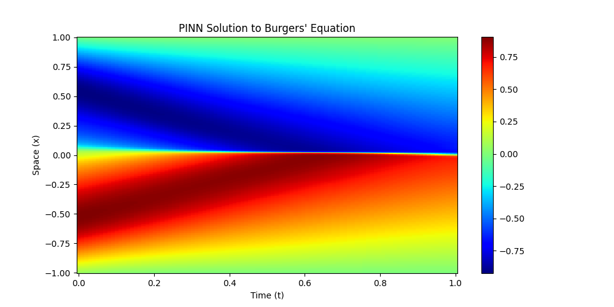
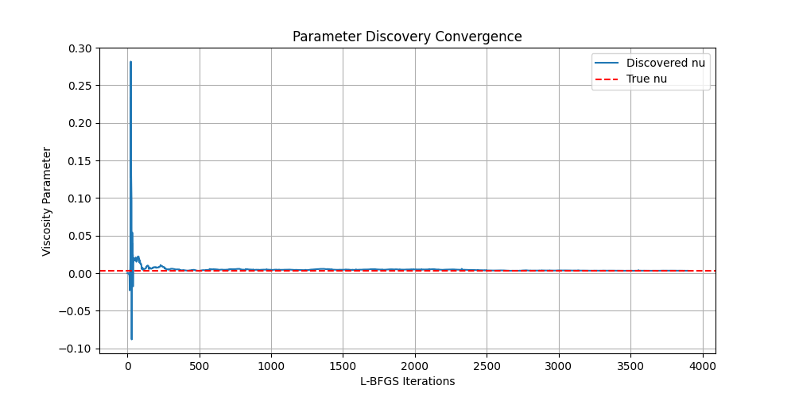
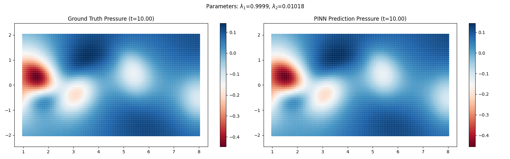
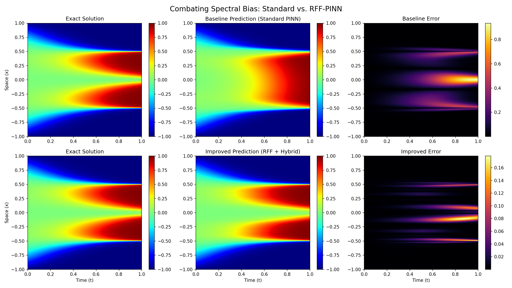
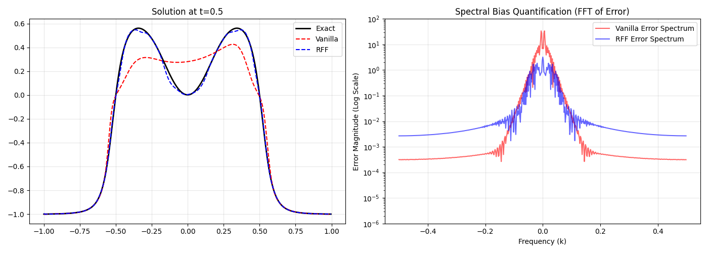

# Physics-Informed Neural Networks (PINNs)

This repository documents a progression of exercises in Physics-Informed Deep Learning, moving from fundamental forward/inverse problems to handling noisy data and combating spectral bias in stiff PDEs.

## References

The implementations and experiments in this repository are based on the following foundational papers:
* **Physics Informed Deep Learning (Part 1 & 2):** Raissi, M., Perdikaris, P., & Karniadakis, G.E.
* **An Expert's Guide to Training Physics-informed Neural Networks:** Wang, S., Sankaran, S., Wang, H., & Perdikaris, P.
* **Self-Adaptive Physics-Informed Neural Networks using a Soft Attention Mechanism:** McClenny, L., & Braga-Neto, U.

---

## 1. Burgers' Equation

The project begins with the standard benchmark for viscous fluid flow: the 1D Burgers' equation. This section covers both the forward (simulation) and inverse (discovery) problems.

### Forward Problem (Simulation)
**Goal:** Solve for the velocity field $u(t,x)$ given boundary and initial conditions.

* **Discussion:** The heatmap above visualises the solution $u(t,x)$. The PINN successfully learns the non-linear dynamics, correctly capturing the formation of the shock wave at $x=0$ as time progresses. The sharp gradient at the shock interface is smooth enough for the network to approximate without special modifications.

### Inverse Problem (Parameter Discovery)
**Goal:** Discover the unknown parameters ($\lambda$) in the PDE from observed data.

* **Discussion:** The figure shows the convergence of the trainable parameters $\lambda_1$ and $\lambda_2$ over training epochs. Using standard Adam optimisation, the model quickly identifies the true physical coefficients of the equation, demonstrating that PINNs can effectively solve inverse problems even with limited data.

---

## 2. Navier-Stokes Equation

This section escalates to the 2D Navier-Stokes equation (incompressible flow past a cylinder). The focus here was on solving the inverse problem to reconstruct the flow field and pressure from sparse velocity measurements.

**Key Findings:**
* **Optimisation Strategy:** Pure Adam optimisation struggled to converge. A hybrid strategy (Adam for coarse training followed by L-BFGS for fine-tuning) was strictly necessary to achieve accurate results.
* **Robustness to Noise:** The model was tested against data corrupted with **5% Gaussian noise**.

* **Discussion:** The comparison above shows the reconstructed pressure field (right) versus the ground truth (left). Despite the 5% noise added to the velocity data, the physics loss acts as a regulariser, filtering out the Gaussian noise and allowing the PINN to recover the clean, underlying vortex street structure. Experiments with weighting the physics loss terms showed that a balanced weighting (all weights $\approx 1.0$) was surprisingly robust compared to complex dynamic weighting schemes.

---

## 3. Allen-Cahn Equation

The final and most challenging exercise involves the Allen-Cahn equation. This reaction-diffusion system exhibits sharp phase transitions that are notoriously difficult for standard neural networks due to **Spectral Bias** (the tendency of NNs to learn low-frequency functions first).

### Combating Spectral Bias (RFF)
**Problem:** A vanilla PINN using Adam optimisation consistently failed to capture the sharp peaks and troughs, often collapsing to a trivial solution or a smoothed-out approximation.

* **Discussion:**
    * **Top Row (Vanilla PINN):** The standard model struggles to capture the high-frequency components of the solution, resulting in significant error near the sharp interfaces.
    * **Bottom Row (RFF-PINN):** By introducing **Random Fourier Features (RFF)**, the network is embedded into a higher-dimensional feature space. This effectively "unlocks" the high-frequency modes, allowing the model to capture the sharp transitions almost perfectly.
    * **Optimisation:** While L-BFGS helped the vanilla model slightly, the RFF embedding was the critical factor in solving the spectral bias issue. Mini-batching was also employed to prevent the optimiser from getting stuck in trivial local minima.

### Spectral Analysis

* **Discussion:** The plot above quantifies the error across the frequency spectrum. The Vanilla PINN (Red) has high error in the high-frequency domain (high $k$), confirming spectral bias. The RFF model (Blue) maintains low error across the entire spectrum.

### Self-Adaptive PINNs
**Method:** Implements a soft attention mechanism where the network learns a mask of weights for the collocation points.

* **Discussion:** This approach turns the training into a minimax game: the network tries to minimise loss, while a mask tries to maximise it by finding "hard" regions. The result is a model that automatically focuses its computational resources on the sharp interface regions without manual mesh refinement.