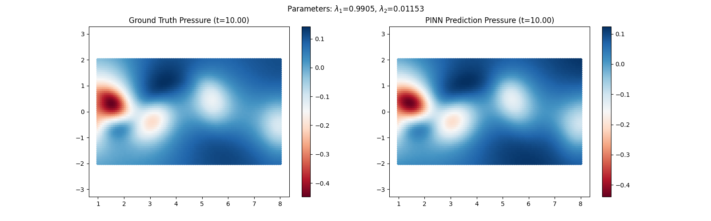
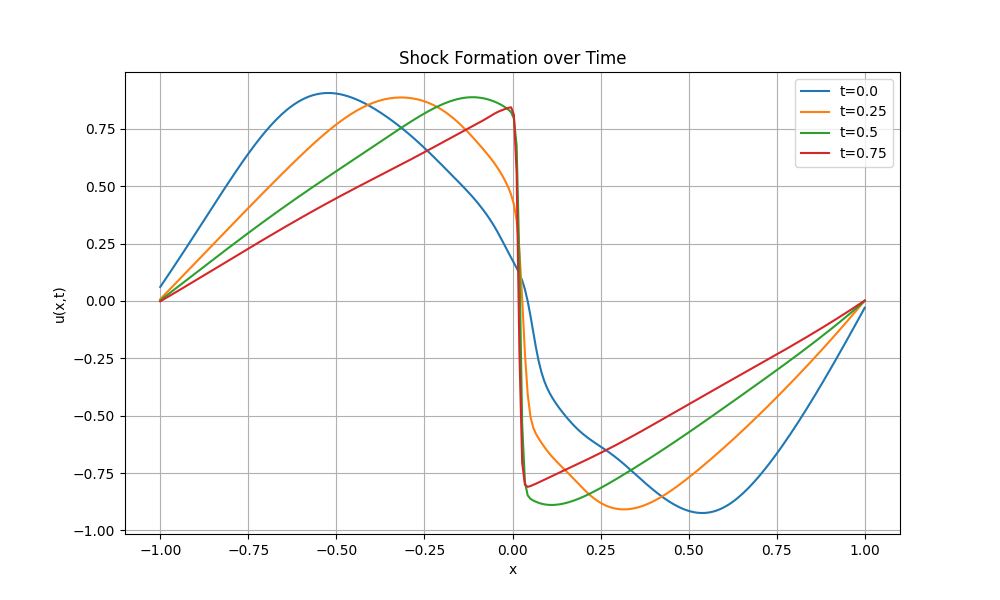

# Physics-Informed Neural Networks (PINNs) for Fluid Dynamics

This repository contains implementations of Physics-Informed Neural Networks (PINNs) using **PyTorch**. The project explores both **Forward Problems** (solving PDEs from scratch) and **Inverse Problems** (discovering hidden physics parameters from noisy data) for the Burgers' Equation and 2D Navier-Stokes equations.

**Key Result:** Successfully recovered the Reynolds number ($Re \approx 100$) and reconstructed the pressure field from raw velocity video data with **<1% error** on the convection parameter.

## 1. Project Overview

The repository is structured into three main modules dealing with increasing complexity:

### A. Navier-Stokes Parameter Discovery (2D)
* **Goal:** Identify the unknown parameters $\lambda_1$ (convection) and $\lambda_2$ (viscosity) from the Navier-Stokes equations using velocity data $(u, v)$ from a cylinder wake.
* **Method:** Trained a dense MLP (9 layers, 50 neurons) using the **L-BFGS** optimizer with **Strong Wolfe** line search.
* **Outcome:** * Correctly identified parameters despite high noise.
    * **Pressure Field Reconstruction:** Recovered the pressure field $p(t,x,y)$ purely from kinematic observation, without solving the Poisson equation.


*Figure 1: Comparison of Ground Truth pressure (Left) vs. PINN inferred pressure (Right).*

### B. Burgers' Equation: Inverse Discovery (1D)
* **Goal:** Discover the viscosity parameter $\nu$ in the equation $u_t + uu_x = \nu u_{xx}$.
* **Challenge:** The model had to handle noisy data (2.5% noise added) and avoid "spectral bias" (getting stuck in smooth solutions).
* **Result:** Recovered $\nu$ with **3.85% error** using a Physics-Regularized Loss.


*Figure 2: Convergence of the unknown parameter $\nu$ during training.*

### C. Burgers' Equation: Forward Simulation (1D)
* **Goal:** Solve the equation $u_t + uu_x - (0.01/\pi)u_{xx} = 0$ given only initial and boundary conditions.
* **Result:** The network learned to capture the formation of a shock wave at $x=0$.

*Figure 3: Time snapshots of the Burgers' Equation system.*


*Figure 4: Heatmap of the Burgers' Equation system.*

## Technical Approach
- **Deep Learning Framework:** PyTorch
- **Optimiser:** L-BFGS with Strong Wolfe line search
- **Physics Loss:** Automatic Differentiation used to compute the Physics-Regularized Loss.
- **Input Normalisation:** Normalisation of the input data to zero mean and unit variance.

## Usage
1. **Install the required packages:**
```bash
pip install torch numpy pandas matplotlib scipy
```

2. **Download Data:** Place `cylinder_nektar_wake.mat` into the `navier_stokes` folder.

3. **Run the Scripts:** Navigate to the desired folder and run the script `navier_stokes.py`.

4. **Visualise Results:** Run `pressure_vis.py` to visualise the results.

## References
- Raissi, M., Perdikaris, P., & Karniadakis, G. E. (2019). Physics-informed neural networks: A deep learning framework for solving forward and inverse problems involving nonlinear partial differential equations. Journal of Computational Physics, 378, 686-707.

